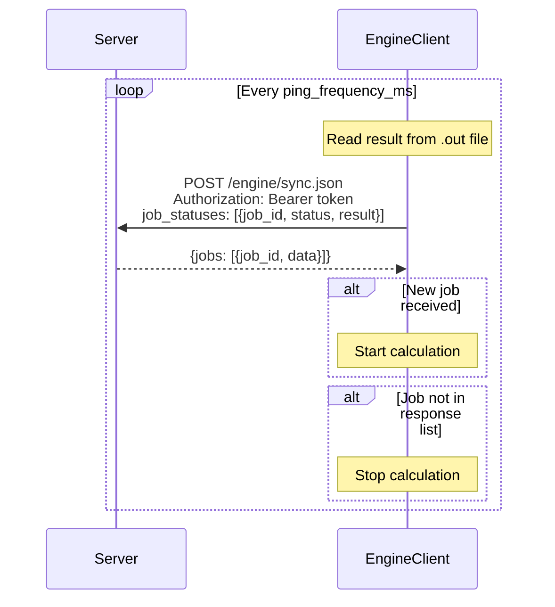

# EngineClient Communication Model

## Overview

Client and server communicate through sync endpoint. Client sends job status updates (including periodic updates when calculation results change).
Client sends the status of the jobs that are running.
Client receives the jobs that should be running in response.

## Communication Flow Diagram



## Communication Flow

### Sync Endpoint

**Endpoint**: `POST /engine/sync.json?engineId={ec_id}`

**Headers**: `Authorization: Bearer {auth_token}`

**Request Payload**:
```json
{
  "job_statuses": [
    {
      "job_id": "...",
      "status": "running" | "completed" | "error",
      "result": "base64_compressed_text",
      "error_message": "..."
    }
  ]
}
```

**Response**:
```json
{
  "jobs": [
    {"job_id": "...", "data": {...}},  // new job - data included
    {"job_id": "..."}                  // existing job - data omitted
  ]
}
```

**Server Behavior**:
- Determines which jobs are "new" by checking if `job_id` exists in client's `job_statuses` request
- Only includes `data` field for new jobs (jobs not in client's `job_statuses`)
- For jobs client already knows about, `data` is omitted (client uses cached data)

**Client Behavior**:
- Sends status updates for all running/completed/error jobs in request
- Periodically sends updates when job calculation results change (for running jobs)
- Receives list of jobs that should be running in response
- Uses cached `data` for jobs it already knows about
- Starts calculations for jobs not currently running
- Stops any currently running job that is not in the response list
- Polls at configured interval

**Status Values**:
- `"running"`: Job is running (sent periodically when results change)
- `"completed"`: Job started successfully (sent once when job starts)
- `"error"`: Job failed to start (sent once when job fails)

**Note**: `result` is a base64-encoded, compressed text file containing the calculation output.

## Configuration

**File**: `config.txt`

**Key Settings**:
- `host`: Server URL (required)
- `auth_token`: Authentication token for server requests (required)
- `max_run`: Maximum CPU cores available (default: CPU count - 1)
- `max_run_per_job`: Maximum cores per job (default: 30)
- `max_concurrent_jobs`: Maximum concurrent jobs (default: max_run)
- `ping_frequency_ms`: Job polling interval in milliseconds (default: 1000)
- `core_redistribution_interval`: Core redistribution interval in seconds (default: 30)
- `seconds_inactive_before_restart`: Health monitor restart threshold (default: 120)

## Engine Interaction

**Process**: `woshi_engine.exe` (in `e1/` directory)

**File-Based Communication**:
- **Input**: `{script_id}.lls` (calculation data), `{script_id}.old` (optional previous result)
- **Output**: `{script_id}.out` (calculation result)
- **Control**: `{script_id}.pid` (process ID), `{script_id}.req` (request data)

**Execution**:
- Starts detached subprocess: `woshi_engine.exe {script_id} [-rr] -id{random_id}`
- Waits for output file creation (max 50s timeout)
- Monitors process via PID file

**Parallel Execution**:
- Creates parallel input files: `{script_id}$01$.lls`, `{script_id}$02$.lls`, etc.
- Engine reads parallel files to utilize multiple CPU cores
- Core count adjusted by creating/removing parallel files

**Stopping**:
- Terminates process via PID (graceful, then force kill)
- Removes all script files (`.lls`, `.out`, `.pid`, `.req`, parallel files)
- Archives output files before cleanup

## Responsibilities

**Server**: Manages what jobs client should be running.

**Client**: Executes jobs, sends status updates in sync requests.
