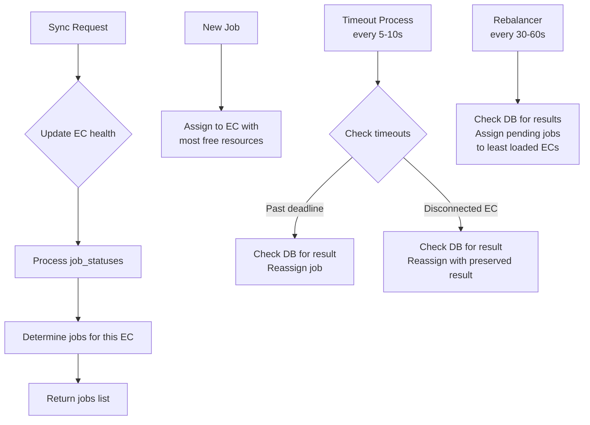
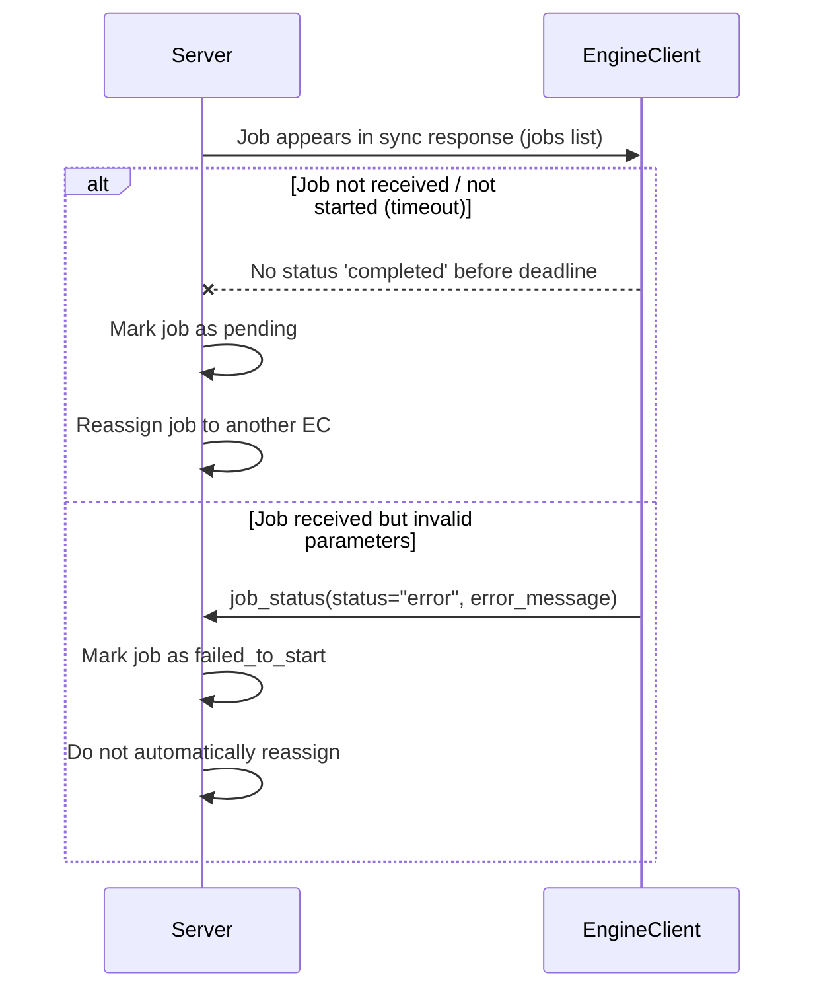

# Server Communication Model

## Overview

Server manages multiple EngineClients (ECs) and decides which EC should run which jobs.  
All coordination happens via a single `/engine/sync.json` endpoint:

- ECs send job status updates (including periodic result updates).
- Server stores results in database and responds with the set of jobs that should be running on that EC.
- When reassigning jobs, server checks database for existing results to enable continuation on different ECs.

## Server Process Flow



---

## Server State Model

### EngineClient (EC)

- `ec_id`: unique identifier for the EC.
- `last_sync_at`: timestamp of last successful `/engine/sync.json` from this EC.

**Connected vs disconnected**

- **Connected**: `now - last_sync_at < 30s` → eligible for new assignments.
- **Disconnected**: `now - last_sync_at >= 30s` → not used for new assignments; its jobs may be reassigned.

### Job (server view)

- `job_id`: unique job identifier.
- `assigned_ec_id` (nullable): EC this job is currently assigned/running on.
- `state` (logical):
  - `pending` – not yet assigned to any EC.
  - `assigned` – sent to an EC, awaiting start confirmation.
  - `running` – EC has confirmed start.
  - `error` – EC reported `status: "error"` for start.
  - `finished` – job finished (from business POV).
- `assigned_at`: when the job was last assigned to an EC.
- `start_confirm_deadline`: time by which the server expects an EC to send `status: "completed"` (start confirmation) after assignment.
- `last_result` (nullable): last result received from any EC for this job (stored when EC sends `status: "running"` with result). Used when reassigning to continue calculation.

---

## Sync Endpoint (Server Perspective)

**Endpoint**: `POST /engine/sync.json?engineId={ec_id}`  
**Headers**: `Authorization: Bearer {auth_token}`

**Request Payload (from EC)**:

```json
{
  "job_statuses": [
    {
      "job_id": "...",
      "status": "running" | "completed" | "error",
      "result": "base64_compressed_text",
      "error_message": "..."
    }
  ]
}
```

---

## Periodic Processes

The server runs two background processes that operate alongside normal request handling.

### 1. Timeout Reassignment Process

- **Frequency**: frequent (e.g. every 5–10 seconds).
- **Scope**: only touches jobs that failed to start or are on disconnected ECs.

**Responsibilities**:

- Find jobs with `state = "assigned"` where `now > start_confirm_deadline`:
  - Check database for existing `last_result` for this job.
  - Set job back to `pending` and **reassign immediately** to another connected EC (most free capacity).
  - If `last_result` exists, include it as \"old\" data when sending to new EC.
- Find jobs with `state = "running"` where `assigned_ec_id` points to a **disconnected** EC (no sync for ≥ 30s):
  - Check database for `last_result` for this job.
  - Mark job as ready for reassignment and include `last_result` as the \"old\" state when sending to the new EC, so calculation can continue from where it left off.

### 2. Rebalancer Process

- **Frequency**: less frequent (e.g. every 30–60 seconds).
- **Scope**: optimization only; does not handle hard failures.

**Responsibilities**:

- Recompute load for all **connected** ECs (based on number of running jobs per EC from the database).
- Look at jobs that are `pending` (new or previously failed to start) and assign them to the least loaded ECs.
- When reassigning jobs (e.g. from overloaded to underloaded ECs), check database for `last_result` and include it as \"old\" data to continue calculation.

Both processes should use **state-based, atomic updates** (e.g. `UPDATE ... WHERE state = 'pending'`) so that they do not conflict with normal job creation or per-request assignment logic.

---

## Job Failure Handling Diagram



This diagram shows the two distinct failure modes:
- **Timeout**: no `status: "completed"` before `start_confirm_deadline` → job is treated as not received and is reassigned.
- **Invalid parameters**: EC returns `status: "error"` → job is marked failed and is not blindly reassigned.
