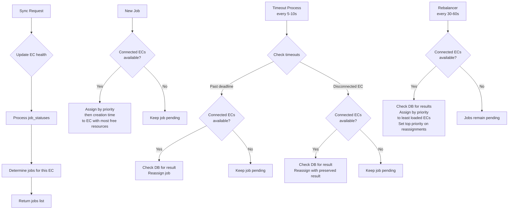

# Server Communication Model

## Overview

Server manages multiple EngineClients (ECs) and decides which EC should run which jobs.  
All coordination happens via a single `/engine/sync.json` endpoint:

- ECs send job status updates (including periodic result updates).
- Server stores results in database and responds with the set of jobs that should be running on that EC.
- When reassigning jobs, server checks database for existing results to enable continuation on different ECs.

## Server Process Flow



---

## Server State Model

### EngineClient (EC)

- `ec_id`: unique identifier
- `last_sync_at`: timestamp of last successful sync
- **Connected**: `now - last_sync_at < 30s` (eligible for assignments)
- **Disconnected**: `now - last_sync_at >= 30s` (jobs may be reassigned)

### Job

- `job_id`: unique identifier
- `assigned_ec_id` (nullable): current EC assignment
- `state`: `pending` | `assigned` | `running` | `error` | `finished`
- `assigned_at`: last assignment timestamp
- `start_confirm_deadline`: deadline for EC to confirm start (`status: "completed"`)
- `last_result` (nullable): last result from any EC (preserved on reassignment)
- `created_at`: creation timestamp
- `priority`: higher number = higher priority (rebalancer reassignments get top priority)

**Assignment Order**: Priority (descending) → `created_at` (ascending)

**Queue Position**: Count of `pending` jobs with higher priority, or same priority but earlier `created_at` (calculated on-demand)

---

## Sync Endpoint

`POST /engine/sync.json?engineId={ec_id}`  
Headers: `Authorization: Bearer {auth_token}`

**Request** (from EC):
```json
{
  "job_statuses": [
    {
      "job_id": "...",
      "status": "running" | "completed" | "error",
      "result": "base64_compressed_text",
      "error_message": "..."
    }
  ]
}
```

**Response**: List of jobs that should be running on this EC (server determines "new" jobs by checking client's `job_statuses`).

---

## Periodic Processes

### 1. Timeout Reassignment Process (every 5–10s)

Handles jobs that failed to start or are on disconnected ECs:

- `state = "assigned"` + `now > start_confirm_deadline`: Reassign with top priority (preserve `last_result` if exists)
- `state = "running"` + disconnected EC: Reassign with top priority (preserve `last_result`)

### 2. Rebalancer Process (every 30–60s)

Optimizes job distribution:

- Recompute load for all connected ECs (running job count per EC)
- Assign `pending` jobs sorted by priority → `created_at` to least loaded ECs (preserve `last_result` if exists)
- Reassignments get top priority

Both processes use **atomic state updates** to avoid conflicts with normal request handling. Jobs remain `pending` if no connected ECs available.

---

## Job Failure Handling


**Failure modes**:
- **Timeout**: No `status: "completed"` before deadline → reassigned
- **Error**: EC reports `status: "error"` → marked failed, not reassigned
