## 1. System Overview

## 2. Database Schema

## 3. Manager Selection Process

```mermaid
flowchart TD
    A[New Schedule Task] --> B[Calculate Available Cores per Manager]
    B --> C[Assign to Manager with Most Available Cores]

    subgraph "Manager Pool - Available Cores"
        M1["Manager 1<br/>16 total cores<br/>4 cores used<br/>📊 12 cores available"]
        M2["Manager 2<br/>12 total cores<br/>8 cores used<br/>📊 4 cores available"]
        M3["Manager 3<br/>8 total cores<br/>7 cores used<br/>📊 1 core available"]
    end

    subgraph "Core Calculation"
        CC["Calculate how many cores the schedule would get if assigned to this manager (based on total cores and max parallels per schedule)."]
    end

    B --> CC
    C --> M1
    
    style M1 fill:#90EE90
    style M2 fill:#FFE4B5
    style M3 fill:#FFA07A
```

## 4. Manager-Server Communication

### Manager Communication (Manager POV)

### Manager Communication (Server POV)

## 5. State Reconciliation

### Manager-Server State Reconciliation Process

## 6. State Diagrams

### Schedule Calculation States

### Start Calculation Task States

### Stop Calculation Task States

## 7. Core Process Flows

### Start Calculation Sequence

### Stop Calculation Sequence

## 8. Timeout and Monitoring Processes

### Task Deadline Process

### Timeout Manager

## 9. Engine Execution Details

### Engine Started with script_id

# Resource Cleanup and Orphan Detection Process

